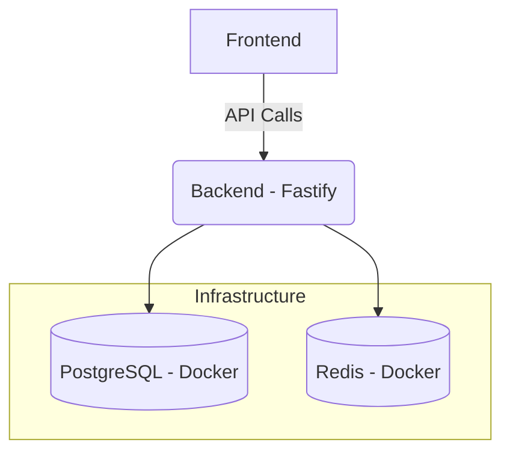

# 🧪 Local Development Setup (Docker-Based)

This guide explains how to run the **DSA Visualizer Backend + Infrastructure** on a fresh machine using Docker.  
No local PostgreSQL, Redis, or Supabase setup is required.

**Target audience:** Frontend developers, new contributors, testers  
**Time required:** ~10–15 minutes

---

## 📦 What This Sets Up

Running this setup gives you a fully functional environment:

- ✅ PostgreSQL (Docker): Persistent data storage  
- ✅ Redis (Docker): Caching and session management  
- ✅ Backend API (Fastify + Prisma): The core logic  
- ✅ Seeded test users: Pre-configured students and teachers for immediate testing  
- ✅ Authentication: Fully working JWT-based auth  

---

## 🔧 Prerequisites

### 1. Install Node.js
- Version: 18+  
- Download: [nodejs.org](https://nodejs.org)  
- Verify:
```bash
node -v
npm -v
```

### 2. Install Docker Desktop
- Download: Docker Desktop (docker.com)
- Action: Install and restart your system. Ensure Docker Desktop is running before proceeding.
- Verify:
```bash
docker --version
docker compose version
```

---

## 🚀 Backend Setup (One-Time)

### Step 1: Clone the backend repository
```bash
git clone <BACKEND_REPO_URL>
cd backend
```

### Step 2: Create environment file
```bash
cp .env.example .env
```
⚠️ Warning: Do NOT modify .env unless explicitly instructed.

### Step 3: Start infrastructure (Postgres + Redis)
```bash
docker compose up -d
```
Verify containers are running:
```bash
docker ps
```
You should see `dsavisualizer_db` and `dsavisualizer_redis` in the list.

### Step 4: Install dependencies
```bash
npm install
```

### Step 5: Run database migrations
```bash
npx prisma migrate dev
```
This creates tables, applies constraints, and prepares your schema.

### Step 6: Seed the database
```bash
npx prisma db seed
```
This populates your DB with a test university, students, teachers, and sample progress data.

### Step 7: Start backend server
```bash
npm run dev
```
- Backend URL: `http://localhost:3000`
- Health check: `GET http://localhost:3000/api/health`

---

## 🎨 Frontend Setup

### Step 8: Configure frontend API URL
In your frontend project directory, update your `.env` file:
```env
VITE_API_URL=http://localhost:3000/api
```
Then run:
```bash
npm run dev
```

---

## 🔐 Test Accounts (Seeded)

| Role    | Email                       | Password      |
|---------|-----------------------------|---------------|
| Student | priya.sharma@srmist.edu.in  | Student@123   |
| Teacher | anitha.r@srmist.edu.in      | Teacher@123   |

---

## 🧠 How This Works (Mental Model)



---

## 🧼 Resetting Everything

If you get stuck or the data becomes corrupted, run the "nuclear option" to start fresh:

```bash
docker compose down -v
docker compose up -d
npx prisma migrate dev
npx prisma db seed
```

---

## 🆘 Common Issues

- **Docker not starting?** Restart Docker Desktop or your system.
- **Port 5432 already in use?** You likely have a local PostgreSQL service running. Stop it so Docker can claim the port.
- **Prisma errors?** Ensure your Docker containers are actually running (`docker ps`) before running migrations.

---

## ✅ You’re Ready!
Your dashboards should now be fully functional.
